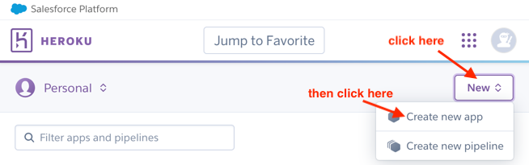

# README

## Useful Links
* Github repo: https://github.com/yeonchae62/LIVE
* Deployment: https://evg-library-8a920fa9c3cb.herokuapp.com/
* Code Climate Reports: https://codeclimate.com/github/yeonchae62/LIVE


## Tech Stack

- **Ruby on Rails**
- **SQLite** as database for development, **PostgreSQL** as database for production
- **Bootstrap** for styling
- **Cucumber** for BDD
- **RSpec** for unit testing
- **SimpleCov** for coverage report


## Getting Started

### Dependencies

- Ruby 3.3.0
- Rails 7.1.3

### Setup

#### Clone the Repo
- run `git clone https://github.com/yeonchae62/LIVE.git` to clone the repo.
- run `cd LIVE` to change the current working directory.

#### Install RVM (Skip if you have already installed)
- Follow instructions [here](https://rvm.io/rvm/install) to install Ruby Version Manger (RVM).

#### Install Ruby (Skip if you have already installed)
- run `rvm install 3.3.0` to install the required ruby version.
- run `rvm use 3.3.0` to activate the installed version.

#### Check Ruby Version
- run `ruby -v` to check if the ruby 3.3.0 is actually used. If the ruby version is incorrect or not installed, please refer to the steps above to install and activate the correct version.


### Configuration(for development)
  * run `bundle install` or ` bundle config set --local without 'production'` to install ruby dependencies.
  * run the following commands to set up the database: 
    ```bash
    bin/rails db:create
    bin/rails db:migrate
    bin/rails db:seed
    ```
  * run `bin/rails s` to start the server
  * open the application by clicking the link appearing in your terminal or pasting this in your browser: http://127.0.0.1:3000.
  * Use Ctrl-C to stop the server

### Testing
  * run `bin/rails db:test:prepare` to setup the database.
  * run `bundle exec rspec` to run Rspec tests.
  * run `bundle exec cucumber` to run Cucumber tests


## Deploy to Heroku

  * Signup or login to your [Heroku](https://id.heroku.com/login) account. 
  * Create a new app on heroku. 
    * Open [this page](https://dashboard.heroku.com/apps) or paste this in your browser: https://dashboard.heroku.com/apps, then you will see the following page: 
    
        
    
    * Click the button "New" at the top right corner and then click "Create new app". Then you will see this:

        
      
    * Fill in the App name and click "Create app" to create your app. Note that the App name will be part of the deployment link. In our team, we used "evg-library" for the App name, so we got "https://evg-library-8a920fa9c3cb.herokuapp.com/" for the deployed app.
  * Add Postgres to your app. On the dashboard page (https://dashboard.heroku.com/apps), you will see the created app. Click that app to open the setting page. Then click "Resources" and search "postgres" in the "Add-ons" field. Choose a plan according to your needs. We used the Mini plan for the course project.  
    
    

  * Download and install the Heroku CLI to your local environment by following the instructions here: https://devcenter.heroku.com/articles/heroku-cli
  
  * If you haven't already, run `git clone https://github.com/yeonchae62/LIVE.git` and `cd LIVE`.

    Under the project folder `LIVE/`, run the following commands to deploy the repo to Heroku.
    * run `heroku login` to connect to heroku. 
    * run `heroku git:remote -a [app-name]`, replace the [app-name] with your App name.
    * run `git push heroku main` to deploy the project. The link to the deployed app will appear in the terminal. 
    You can also get it on Heroku website. 
    
      But you will see errors if you open the link at this point because we haven't set up the database.
    * run `heroku run rails db:migrate db:seed` to set up the database. Now you can visit the link you got in the last step.


## How to contact us:
  * Komo Zhang: <komo@tamu.edu>
  * Nilo Lisboa: <nl6867@tamu.edu>
  * Xiuyu Tang: <xiuyu@tamu.edu>
  * Yeon Chae: <yeonchae62@tamu.edu>
  * Zachary McDowell: <cholmcdowell@tamu.edu>
